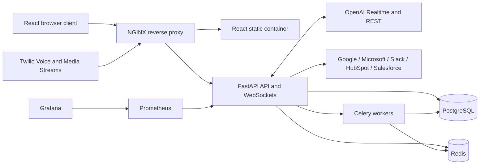
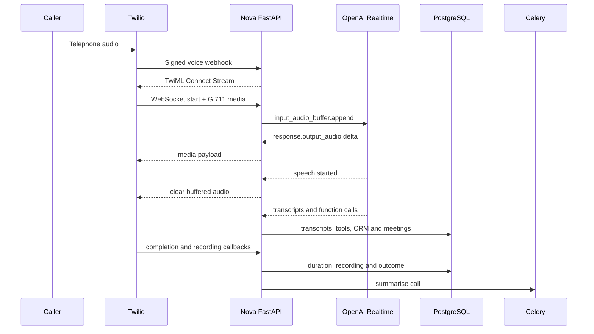

# Architecture

## Container topology

## Voice call sequence

## Design decisions

- Synchronous SQLAlchemy sessions keep the transactional model simple and work well with FastAPI’s threadpool for normal API traffic.
- Voice streaming is asynchronous and uses short-lived database sessions for durable events and transcripts.
- Every business record carries an organisation boundary. Route dependencies enforce the boundary before reading or changing a record.
- Refresh tokens are rotated and stored as hashes. Reuse of a rotated token revokes the full token family.
- Provider credentials, OAuth tokens, and webhook secrets are encrypted at rest; outbound webhook and push targets are checked against production SSRF policy.
- The local voice and embedding implementations are deterministic operational modes, not dead code. They make the complete application testable without external accounts.
