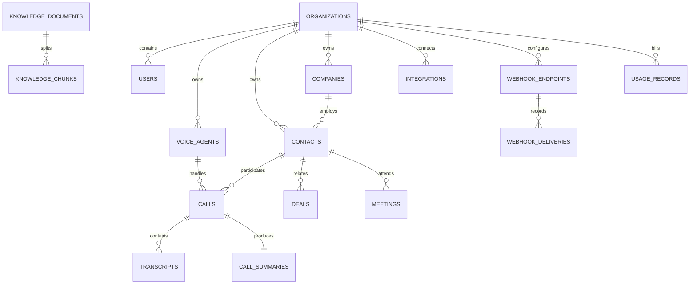

# Database model

## Tables

The initial Alembic migration creates organisations, users, refresh tokens, one-time tokens, API keys, prompts, voice agents, companies, contacts, deals, CRM notes, CRM tasks, activities, calls, call events, transcripts, call summaries, meetings, knowledge documents, knowledge chunks, integrations, webhook endpoints, webhook deliveries, notifications, usage records, system settings, and audit logs.

Identifiers are UUID strings. Business tables use `created_at`, `updated_at`, and where appropriate `deleted_at`. Foreign keys define cascade, restrict, or set-null behaviour explicitly. High-volume access paths include organisation, status, phone, email, call start, meeting time, usage period, transcript sequence, and audit request indexes.
